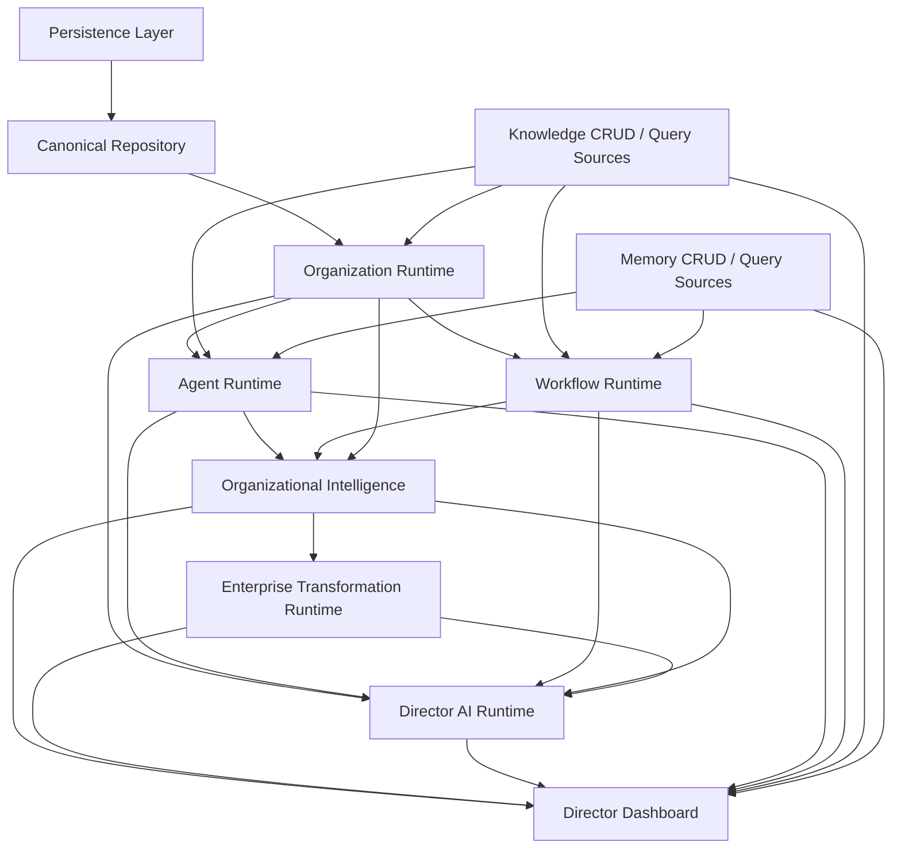

# 64 - Product Runtime Consolidation Review v1.0

## Purpose

This document is the architectural consolidation review for the current Hebun product runtime. It does not introduce new implementation. It evaluates the runtime stack as it exists today, identifies dependency boundaries, detects overlap, and determines whether the current system is structurally ready to support the first real-company MVP.

This review treats Memory as authoritative runtime infrastructure and PostgreSQL as inactive for product runtime behavior.

## 2026-07-13 Re-Assessment Update

This document was re-evaluated after Runtime Ownership Completion.

### Previous NO-GO Finding Status

| Finding | Previous State | Current State | Status | Code Evidence |
| --- | --- | --- | --- | --- |
| Dashboard bypassed runtime ownership for executive domains | Dashboard read knowledge and memory query layers directly | Dashboard now reads `MissionRuntimeService`, `GoalRuntimeService`, `KnowledgeRuntimeService`, `MemoryRuntimeService`, `DecisionRuntimeService`, and `ExecutiveTimelineRuntimeService` | RESOLVED | [src/features/director-dashboard/foundation.ts](/Users/senolsevim/Documents/Siteler/Hebun%20AI/apps/dashboard/src/features/director-dashboard/foundation.ts) |
| Goals, missions, decisions, and timeline lacked runtime owners | Page-owned projections | Dedicated runtime owners now exist | RESOLVED | [src/features/mission-runtime/mission-runtime-service.ts](/Users/senolsevim/Documents/Siteler/Hebun%20AI/apps/dashboard/src/features/mission-runtime/mission-runtime-service.ts), [src/features/goal-runtime/goal-runtime-service.ts](/Users/senolsevim/Documents/Siteler/Hebun%20AI/apps/dashboard/src/features/goal-runtime/goal-runtime-service.ts), [src/features/decision-runtime/decision-runtime-service.ts](/Users/senolsevim/Documents/Siteler/Hebun%20AI/apps/dashboard/src/features/decision-runtime/decision-runtime-service.ts), [src/features/executive-timeline-runtime/executive-timeline-runtime-service.ts](/Users/senolsevim/Documents/Siteler/Hebun%20AI/apps/dashboard/src/features/executive-timeline-runtime/executive-timeline-runtime-service.ts) |
| Knowledge and memory summaries were page-owned | Dashboard-level aggregation | Thin runtime-owned summary surfaces now exist | RESOLVED | [src/features/knowledge-runtime/knowledge-runtime-service.ts](/Users/senolsevim/Documents/Siteler/Hebun%20AI/apps/dashboard/src/features/knowledge-runtime/knowledge-runtime-service.ts), [src/features/memory-runtime/memory-runtime-service.ts](/Users/senolsevim/Documents/Siteler/Hebun%20AI/apps/dashboard/src/features/memory-runtime/memory-runtime-service.ts) |
| Organization Runtime depended on mocks and fabricated company defaults | Mock-backed structure and seeded defaults | Still mock-backed and derived | UNRESOLVED | [src/features/organization-runtime/foundation.ts](/Users/senolsevim/Documents/Siteler/Hebun%20AI/apps/dashboard/src/features/organization-runtime/foundation.ts) |
| Agent Runtime behaved like a decorated CRUD facade | Direct low-level reads | Still directly reads agent, workflow, knowledge, and memory CRUD | UNRESOLVED | [src/features/agent-runtime/agent-runtime-engine.ts](/Users/senolsevim/Documents/Siteler/Hebun%20AI/apps/dashboard/src/features/agent-runtime/agent-runtime-engine.ts) |
| Workflow Runtime behaved like a decorated CRUD facade | Direct low-level reads | Still directly reads workflow CRUD and workflow context still reads knowledge/memory CRUD | UNRESOLVED | [src/features/workflow-runtime/workflow-runtime-engine.ts](/Users/senolsevim/Documents/Siteler/Hebun%20AI/apps/dashboard/src/features/workflow-runtime/workflow-runtime-engine.ts), [src/features/workflow-runtime/workflow-context-service.ts](/Users/senolsevim/Documents/Siteler/Hebun%20AI/apps/dashboard/src/features/workflow-runtime/workflow-context-service.ts) |
| Mission runtime was absent | Empty dashboard placeholder | Runtime exists, but it is heuristic and derived from `KnowledgeNodeRecord` entries of type `Organization` tagged `goals` | PARTIALLY RESOLVED | [src/features/mission-runtime/mission-runtime-service.ts](/Users/senolsevim/Documents/Siteler/Hebun%20AI/apps/dashboard/src/features/mission-runtime/mission-runtime-service.ts), [src/features/knowledge-crud/types.ts](/Users/senolsevim/Documents/Siteler/Hebun%20AI/apps/dashboard/src/features/knowledge-crud/types.ts) |
| Director AI should remain runtime-only | Runtime-only | Still runtime-only, with no CRUD/query imports in Director AI feature layer | RESOLVED | [src/features/director-ai-runtime/executive-context-service.ts](/Users/senolsevim/Documents/Siteler/Hebun%20AI/apps/dashboard/src/features/director-ai-runtime/executive-context-service.ts) |
| Director AI and Transformation were type-coupled | Shared types across layers | Still present | UNRESOLVED | [src/features/director-ai-runtime/types.ts](/Users/senolsevim/Documents/Siteler/Hebun%20AI/apps/dashboard/src/features/director-ai-runtime/types.ts), [src/features/enterprise-transformation-runtime/types.ts](/Users/senolsevim/Documents/Siteler/Hebun%20AI/apps/dashboard/src/features/enterprise-transformation-runtime/types.ts) |
| Persistence was not cut over | Memory active, PostgreSQL passive | Still unchanged | UNRESOLVED | [src/features/persistence/storage-manager.ts](/Users/senolsevim/Documents/Siteler/Hebun%20AI/apps/dashboard/src/features/persistence/storage-manager.ts), [src/features/persistence/provider-registry.ts](/Users/senolsevim/Documents/Siteler/Hebun%20AI/apps/dashboard/src/features/persistence/provider-registry.ts) |

### Updated Executive Summary

Runtime Ownership Completion removed the biggest presentation-layer architectural defect: the Director Dashboard no longer reads CRUD/query modules directly for goals, missions, knowledge overview, memory overview, decisions, or timeline.

That is a real structural improvement.

However, the platform is still not ready to manage its own company. The remaining blockers are now concentrated below the executive layer:

1. Mission Runtime is still heuristic and can display an inferred strategic state rather than a first-class mission record.
2. Organization Runtime is still heavily mock-backed and derived.
3. Agent Runtime and Workflow Runtime still depend directly on CRUD/query modules.
4. Persistence has not cut over. The active provider is still in-process memory, so runtime data does not survive a process restart.
5. The runtime loop still becomes partially fictional at the mission and execution edges.

### Updated Runtime Safety Finding

The first broken link in the intended runtime loop is now:

Company  
-> **Mission**

The reason is simple: there is no first-class `Mission` record in the active Memory CRUD type system, and Mission Runtime currently infers mission state from `KnowledgeNodeRecord` entries whose `nodeType` is `Organization` and whose tags include `goals`. That is not strong enough for internal dogfooding without warnings, and not acceptable for external customer use.

## Scope Reviewed

- Organization Runtime
- Agent Runtime
- Workflow Runtime
- Organizational Intelligence
- Director AI Runtime
- Enterprise Transformation Runtime
- Director Dashboard
- Canonical Repository
- Canonical Read Platform
- Shadow Read Platform
- Persistence Layer

## Executive Summary

Hebun now has a meaningful product runtime stack rather than isolated feature slices. The system already expresses a coherent upward flow:

Organization Runtime  
-> Agent Runtime + Workflow Runtime  
-> Organizational Intelligence  
-> Enterprise Transformation Runtime  
-> Director AI Runtime  
-> Director Dashboard

That is the strongest architectural accomplishment of the current phase.

The primary weaknesses are not conceptual. They are boundary weaknesses:

1. The Director Dashboard still bypasses runtime services for some sections and reads CRUD/query layers directly.
2. Organization, Agent, and Workflow runtimes are runtime facades, but they still depend on low-level CRUD/query and mock sources rather than a single canonical runtime data boundary.
3. Director AI is runtime-oriented, but it is coupled to Enterprise Transformation through shared types and direct orchestration.
4. Several core loops are observational rather than fully closed. Execution, learning, and mission-driven feedback exist only partially in the product runtime.
5. The platform is structurally promising, but not yet enterprise-ready without additional consolidation and de-mocking.

## Runtime Dependency Audit

### 1. Organization Runtime

#### Owns

- Company runtime model
- Department runtime model
- Human runtime model
- Membership runtime model
- Role runtime model
- Organization hierarchy traversal
- Parent-child organizational relationships

#### Depends On

- Agent CRUD query sources
- Workflow CRUD query sources
- Knowledge CRUD query sources
- Mock HR and approval sources
- Internal organization runtime services

#### Depended On By

- Agent Runtime
- Workflow Runtime
- Organizational Intelligence
- Director AI Runtime

#### Boundary Assessment

The Organization Runtime is the intended authoritative runtime view of organizational structure, but its current foundation is still assembled from CRUD/query and mock data sources. This is acceptable for an MVP foundation, but it violates the long-term runtime isolation goal.

#### Overlap

- Ownership and hierarchy logic correctly live here.
- Some organizational facts are indirectly recomputed elsewhere through downstream projections.

### 2. Agent Runtime

#### Owns

- Agent identity
- Agent lifecycle
- Agent health
- Agent authority
- Agent capabilities
- Agent workload
- Agent context
- Agent responsibilities

#### Depends On

- Agent CRUD query sources
- Knowledge CRUD query sources
- Memory CRUD query sources
- Workflow CRUD query sources
- Organization Runtime
- Agent execution readiness helpers

#### Depended On By

- Organizational Intelligence
- Director AI Runtime
- Director Dashboard
- Workflow Runtime

#### Boundary Assessment

The Agent Runtime behaves like a runtime engine, but it is still built directly on top of CRUD/query modules. It is therefore runtime-shaped rather than fully runtime-isolated.

#### Overlap

- Health and workload ownership mostly live here.
- Knowledge and memory profile derivation also appear in downstream intelligence projections.

### 3. Workflow Runtime

#### Owns

- Workflow identity
- Workflow hierarchy
- Workflow context
- Workflow responsibilities
- Workflow dependencies
- Workflow progress
- Workflow health

#### Depends On

- Workflow CRUD query sources
- Knowledge CRUD query sources
- Memory CRUD query sources
- Planning query sources
- Organization Runtime
- Agent Runtime

#### Depended On By

- Organizational Intelligence
- Director AI Runtime
- Director Dashboard

#### Boundary Assessment

Workflow Runtime centralizes workflow projection correctly, but its internals still pull low-level records directly. It is not yet protected behind a single repository or canonical runtime read surface.

#### Overlap

- Progress and dependency logic largely live here.
- Health is also summarized again inside Organizational Intelligence.

### 4. Organizational Intelligence

#### Owns

- Runtime observation model
- Enterprise health model
- Risk detection
- Opportunity detection
- Performance scoring
- Capacity scoring
- Executive insight synthesis

#### Depends On

- Organization Runtime
- Agent Runtime
- Workflow Runtime
- Governance read surfaces
- Memory engine report

#### Depended On By

- Enterprise Transformation Runtime
- Director AI Runtime
- Director Dashboard

#### Boundary Assessment

This is the strongest runtime boundary in the product stack. It consumes runtime services and produces higher-order intelligence. It does not behave like CRUD and does not expose persistence concerns.

#### Overlap

- Health, risk, and opportunity ownership belong here and mostly remain centralized.
- Transformation computes a second layer of maturity/readiness scoring on top of these observations.

### 5. Enterprise Transformation Runtime

#### Owns

- Transformation maturity assessment
- Transformation readiness assessment
- Transformation domain gaps
- Transformation initiatives
- Transformation roadmap
- Transformation recommendations

#### Depends On

- Organizational Intelligence observations

#### Depended On By

- Director AI Runtime
- Director Dashboard

#### Boundary Assessment

The dependency boundary is clean. The runtime operates as a derivative intelligence layer rather than a peer CRUD domain. This is good architecture.

#### Overlap

- It computes domain scoring and recommendations that partially intersect with Director AI recommendation behavior.

### 6. Director AI Runtime

#### Owns

- Executive context
- Executive question model
- Executive recommendations
- Executive explanations
- Executive navigation surfaces
- Dashboard insight surface

#### Depends On

- Organization Runtime
- Agent Runtime
- Workflow Runtime
- Organizational Intelligence
- Enterprise Transformation Runtime

#### Depended On By

- Director Dashboard

#### Boundary Assessment

Director AI respects the intended runtime-first design. It does not directly read CRUD modules. This is a major architectural success.

#### Overlap

- Recommendation responsibility overlaps partially with Enterprise Transformation.
- Some insight packaging overlaps with the Dashboard presentation layer.

### 7. Director Dashboard

#### Owns

- Executive presentation assembly
- Dashboard snapshot composition
- Section-level display contracts
- Empty-state behavior

#### Depends On

- Organizational Intelligence
- Enterprise Transformation Runtime
- Director AI Runtime
- Agent Runtime
- Workflow Runtime
- Persistence provider registry
- Knowledge CRUD query sources
- Memory CRUD query sources

#### Depended On By

- Product UI only

#### Boundary Assessment

This is the clearest boundary violation in the current product stack. The Dashboard is not purely a consumer of product runtimes. It still reads lower-level query/CRUD sources directly for knowledge, memory, recent decisions, goals, and timeline sections.

#### Overlap

- Dashboard snapshot composition currently owns some domain projection logic that should ultimately live in dedicated runtime or intelligence services.

### 8. Canonical Repository

#### Owns

- Provider-independent repository contracts
- Read repository abstraction
- Shadow repository abstraction
- Capability descriptors
- Non-implemented write repository placeholders

#### Depends On

- Internal type contracts only

#### Depended On By

- Knowledge canonical repository
- Future persistence-backed runtime modules

#### Boundary Assessment

This layer is intentionally small and structurally clean. It is infrastructure-only and does not affect product runtime behavior directly.

### 9. Canonical Read Platform

#### Owns

- Read availability
- Read rollout
- Read comparison
- Read metrics
- Read errors
- Read router

#### Depends On

- Internal platform contracts only

#### Depended On By

- Knowledge silent dual-read
- Shadow read implementations
- Diagnostics

#### Boundary Assessment

This is a well-isolated infrastructure platform. It remains read-only and does not intrude into product runtime responsibilities.

### 10. Shadow Read Platform

#### Owns

- Shadow comparison wiring
- Side-effect-free comparison service
- Shared shadow read helpers

#### Depends On

- Canonical Read Platform exports

#### Depended On By

- Knowledge shadow read
- Actor shadow read
- Execution shadow read

#### Boundary Assessment

This layer is clean and infrastructural. It does not violate product runtime behavior.

### 11. Persistence Layer

#### Owns

- Provider registration
- Provider status
- Provider capabilities
- Active provider declaration

#### Depends On

- Memory provider
- PostgreSQL provider

#### Depended On By

- Diagnostics
- Director Dashboard provider snapshot
- Canonical repository and future read infrastructure

#### Boundary Assessment

The persistence boundary is safe. Memory remains active. PostgreSQL remains registered-only and inactive for product runtime behavior.

## Complete Dependency Graph

## Circular Dependency Review

### Runtime-Level Circular Dependencies

No hard runtime execution loop was found that forces product runtime recursion during normal snapshot construction.

### Type-Level Circular Dependency

A type-level circular coupling exists between Director AI Runtime and Enterprise Transformation Runtime:

- Director AI Runtime references transformation snapshot types.
- Enterprise Transformation Runtime references Director AI recommendation types.

This is not currently a runtime failure, but it is an architectural smell. The two runtimes should remain layered, with Transformation below Director AI.

## Responsibility Audit

### Responsibilities Correctly Centralized

- Organization ownership: Organization Runtime
- Agent health and authority: Agent Runtime
- Workflow dependency and progress: Workflow Runtime
- Health, risk, and opportunity synthesis: Organizational Intelligence
- Provider routing: Canonical Read Platform / Read Router
- Shadow comparison: Shadow Read Platform
- Provider activation state: Persistence Layer

### Duplicate or Partially Duplicated Responsibilities

#### Executive Recommendations

- Current locations:
  - Director AI Runtime
  - Enterprise Transformation Runtime

- Recommendation:
  - Director AI should permanently own executive recommendation packaging.
  - Enterprise Transformation should own transformation-specific findings and initiatives only.

#### Scoring Layers

- Current locations:
  - Organizational Intelligence
  - Enterprise Transformation Runtime

- Recommendation:
  - Organizational Intelligence should own operational health/risk/opportunity scoring.
  - Enterprise Transformation should own transformation maturity/readiness scoring only.

#### Dashboard Section Projection

- Current locations:
  - Director Dashboard
  - Runtime/intelligence services

- Recommendation:
  - Dashboard should only assemble presentation-ready surfaces.
  - Domain projection logic should live in runtime or intelligence services.

#### Knowledge and Memory Summaries

- Current locations:
  - Director Dashboard direct query logic
  - Organizational Intelligence derived observation logic

- Recommendation:
  - A dedicated runtime-facing summary surface should own this responsibility before real-company onboarding.

## Dashboard Audit

| Dashboard Section | Current Source | Authoritative Owner | Deterministic | Heuristics | Future Runtime Work |
| --- | --- | --- | --- | --- | --- |
| Company Overview | Organizational Intelligence + Transformation + Provider Registry | Organizational Intelligence | Yes | Light summary synthesis | Minor |
| Organizational Health | Organizational Intelligence | Organizational Intelligence | Yes | Low | Minor |
| Active Missions | Empty placeholder | None yet | Yes | None | High |
| Active Goals | Direct query-backed projection | Not yet runtime-owned | Yes | Moderate | High |
| Workflow Activity | Workflow Runtime | Workflow Runtime | Yes | Low | Minor |
| Agent Activity | Agent Runtime | Agent Runtime | Yes | Low | Minor |
| Knowledge Overview | Direct knowledge query aggregation | Not yet runtime-owned | Yes | Low | High |
| Memory Overview | Direct memory query aggregation | Not yet runtime-owned | Yes | Low | High |
| Recent Decisions | Direct memory query projection | Not yet runtime-owned | Yes | Moderate | High |
| Alerts & Risks | Organizational Intelligence | Organizational Intelligence | Yes | Low | Minor |
| Opportunities | Organizational Intelligence | Organizational Intelligence | Yes | Low | Minor |
| Executive Timeline | Direct query-backed event synthesis | Not yet runtime-owned | Yes | Moderate | High |
| Director Insights | Director AI Runtime | Director AI Runtime | Yes | Moderate | Medium |
| AI Transformation | Enterprise Transformation Runtime | Enterprise Transformation Runtime | Yes | Low | Minor |

## Director AI Audit

### Required Boundary

Director AI must consume only runtime and intelligence layers.

### Actual State

Director AI currently consumes:

- Organization Runtime
- Agent Runtime
- Workflow Runtime
- Organizational Intelligence
- Enterprise Transformation Runtime

That is compliant with the intended architecture.

### Findings

1. No direct CRUD bypass was found inside the core Director AI runtime services.
2. Director AI is correctly downstream of product runtimes.
3. Director AI is currently coupled to Enterprise Transformation both operationally and through shared types.
4. Director AI recommendations include transformation-oriented advisory content, which partially overlaps with Transformation Runtime responsibilities.

### Conclusion

Director AI does not violate the major runtime boundary, but it should be decoupled from transformation-specific recommendation types before scale.

## Runtime Loop Audit

### Intended Loop

Organization  
-> People + Agents  
-> Workflows  
-> Execution  
-> Knowledge  
-> Memory  
-> Learning  
-> Organizational Intelligence  
-> Director AI  
-> Transformation  
-> Organization

### Current State

#### Present

- Organization -> Agents
- Organization -> Workflows
- Agents + Workflows -> Organizational Intelligence
- Organizational Intelligence -> Transformation
- Organizational Intelligence -> Director AI
- Director AI + Transformation -> Dashboard

#### Partial

- Knowledge loop exists as derived profile data and direct dashboard query summaries.
- Memory loop exists through memory CRUD access and memory engine reporting.
- Learning loop exists as runtime-derived signals, not as a fully independent product runtime.

#### Missing or Broken

1. Execution is not yet a real product runtime participant in the upward loop.
2. Learning is observational, not fully modeled as a closed runtime feedback layer.
3. Transformation does not yet feed back into organization state through governed product actions.
4. Missions and goals are not yet first-class runtime surfaces in the dashboard stack.
5. Dashboard bypasses parts of the runtime loop by reading lower layers directly.

## Enterprise Readiness Review

| Domain | Status | Assessment |
| --- | --- | --- |
| Identity | PARTIALLY READY | Structural relationships exist, but real-company identity depth is not yet fully runtime-owned. |
| Organization | PARTIALLY READY | Good runtime foundation, but still dependent on mock and low-level query sources. |
| Agents | PARTIALLY READY | Strong runtime model, but still built from CRUD/query and derived heuristics. |
| Workflows | PARTIALLY READY | Runtime projection exists, but execution and mission linkage are incomplete. |
| Knowledge | PARTIALLY READY | Observable and summarized, but not yet surfaced through a unified runtime boundary. |
| Memory | PARTIALLY READY | Authoritative at infrastructure level, but product-facing memory runtime remains thin. |
| Governance | PARTIALLY READY | Observable in intelligence, but not yet a fully surfaced product runtime domain. |
| Dashboard | PARTIALLY READY | Valuable control center foundation, but still mixes runtime and low-level data access. |
| Director AI | PARTIALLY READY | Runtime-first and disciplined, but still recommendation-overlapped and not fully decoupled. |
| Transformation | PARTIALLY READY | Architecturally coherent, but depends on upstream runtimes that are not yet fully enterprise-grade. |

### Overall Readiness

Hebun is not yet READY to manage a real company without architectural hardening. It is PARTIALLY READY as an MVP foundation for internal pilot use, controlled demos grounded in live runtime data, and continued consolidation work.

## Architecture Quality Score

| Category | Score / 10 | Notes |
| --- | --- | --- |
| Architecture | 8 | Strong layered intent and clear operating-system direction. |
| Modularity | 7 | Good runtime decomposition, but some coupling remains. |
| Runtime Isolation | 6 | Dashboard and several runtimes still bypass lower boundaries. |
| Maintainability | 7 | Service-oriented structure is solid, but duplicated projections add drag. |
| Enterprise Readiness | 5 | Promising foundation, not yet hard enough for live-company operation. |
| Extensibility | 8 | The runtime layering can scale if boundaries are tightened. |
| AI Native Design | 9 | The product is structurally AI-native rather than assistant-shaped. |
| Observability | 7 | Good infrastructure observability and useful runtime surfaces exist. |
| Governance | 6 | Present conceptually and partially observable, but not yet deeply integrated. |

### Consolidated Score

Overall architecture quality: **7.0 / 10**

This is a serious architectural foundation, not a prototype. It is also not yet the final enterprise operating system described by the reference architecture.

## Critical Consolidation Findings

1. The Dashboard is the largest remaining boundary leak.
2. Product runtimes still depend too directly on CRUD/query and mock sources.
3. Mission, goal, execution, and learning loops are not yet equally mature participants in the runtime system.
4. Transformation and Director AI responsibilities need clearer long-term separation.
5. The current stack is directionally correct and worth continuing, but it needs one more consolidation wave before first-company onboarding.

## Final Conclusion

Hebun now has a credible product runtime architecture with real upward intelligence composition. The current stack demonstrates that the platform can become an enterprise operating system rather than a dashboard or assistant product.

However, the MVP is not launch-ready for the first real company yet. The missing work is not cosmetic. It is concentrated in runtime boundary hardening, elimination of direct low-level reads from presentation layers, de-duplication of intelligence responsibilities, and closure of incomplete operating loops.

Memory remains authoritative.

PostgreSQL remains inactive for product runtime behavior.

## Runtime Projection Layer Update

The consolidation findings led directly to the Runtime Projection Layer decision.

The key correction is:

runtime must not consume repositories or CRUD directly, even when Memory remains authoritative.

Projection now becomes the required intermediary boundary between persistence-facing reads and runtime-facing truth.

## Phase 3C.0A Closure Status

Projection boundaries and immutable snapshot semantics are hardened, but formal closure remains **NO-GO**. Two authoritative Memory seed modules do not complete filesystem reads in the current workspace, preventing full bootstrap, parity, typecheck, lint, build, and regression proof. This does not change the earlier consolidation history or provider authority.

### Phase 3C.0A Re-Validation — 2026-07-15

The recovery blockers are resolved. All nine projections now bootstrap, rebuild deterministically, preserve immutable snapshots on failure, and pass runtime, Director AI, Organizational Intelligence, and Director Dashboard semantic parity checks. Executive Dashboard read summaries use runtime services; provider status uses a diagnostics read boundary; Organizational Intelligence consumes Memory Runtime. Final status: **COMPLETE WITH MINOR DEBT**. Explicitly allowlisted mutation and live operational telemetry workspaces remain outside the executive read-model boundary.
