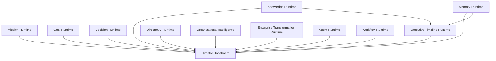
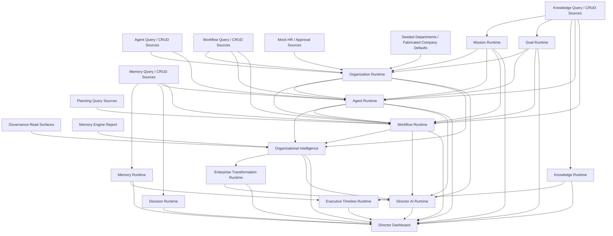
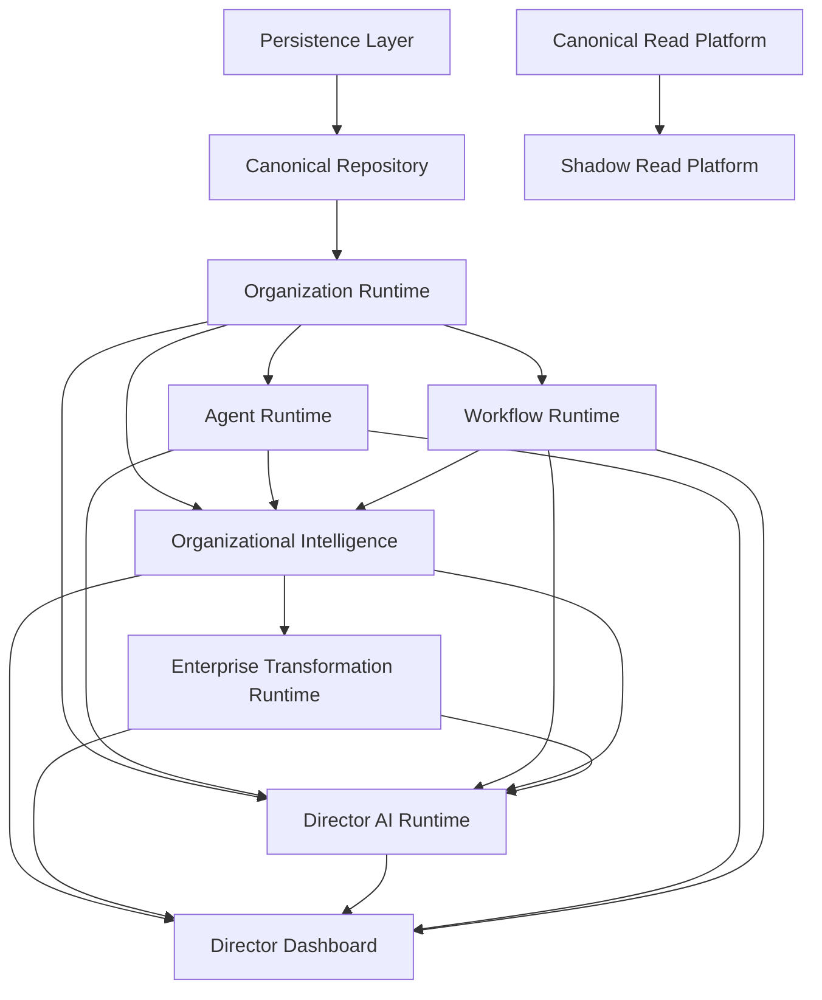
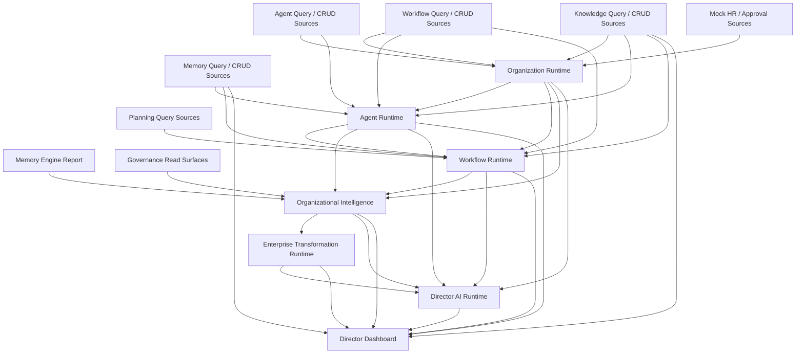

# 67 - Runtime Dependency Graph v1.0

## Purpose

This document provides the consolidated runtime dependency graph for the current Hebun platform.

It answers four questions:

1. What each runtime owns
2. What each runtime depends on
3. What depends on each runtime
4. Where the current boundary risks exist

## 2026-07-13 Re-Assessment Update

### Updated Executive Ownership Layer

### Updated Source-Level Reality

### Updated Boundary Reading

- Dashboard boundary violation from direct low-level reads: **resolved**
- Mission Runtime truthfulness risk: **newly visible and critical**
- Persistence gate: **still unresolved**
- Organization Runtime mock/seed dependence: **still unresolved**
- Agent and Workflow CRUD dependence: **still unresolved**

## Top-Level Stack

## Actual Source-Level Reality

## Ownership Map

| Runtime / Layer | Primary Ownership |
| --- | --- |
| Persistence Layer | Provider registration, status, activation state |
| Canonical Read Platform | Routing, comparison, rollout, metrics, read-only infrastructure |
| Shadow Read Platform | Side-effect-free shadow comparison orchestration |
| Canonical Repository | Provider-independent repository contracts |
| Organization Runtime | Organization structure, hierarchy, humans, memberships, roles |
| Agent Runtime | Agent identity, health, authority, workload, capabilities, context |
| Workflow Runtime | Workflow structure, dependencies, responsibilities, progress, health |
| Organizational Intelligence | Health, risk, opportunity, capacity, executive intelligence |
| Enterprise Transformation Runtime | Maturity, readiness, transformation initiatives and roadmap |
| Director AI Runtime | Executive context, explanations, recommendations, navigation |
| Director Dashboard | Presentation assembly and executive surface composition |

## Boundary Risks

### Clean Boundaries

- Persistence Layer
- Canonical Read Platform
- Shadow Read Platform
- Canonical Repository
- Organizational Intelligence
- Enterprise Transformation Runtime

### Partial Boundaries

- Organization Runtime
- Agent Runtime
- Workflow Runtime
- Director AI Runtime

### Boundary Violations

- No direct Dashboard low-level read violation remains.
- The dominant boundary risk has moved downward into runtime truth and persistence.

## Circular Dependency Notes

### No Major Runtime Execution Cycle

The current stack does not show a blocking runtime recursion across snapshot construction paths.

### Type-Level Coupling

There is a type-level cycle between:

- Director AI Runtime
- Enterprise Transformation Runtime

This should be treated as architectural debt even though it is not yet a runtime failure.

## Dependency Interpretation

### Strongest Structural Path

The strongest and healthiest product-runtime path is:

Organization Runtime  
-> Agent Runtime + Workflow Runtime  
-> Organizational Intelligence  
-> Enterprise Transformation Runtime  
-> Director AI Runtime  
-> Director Dashboard

### Weakest Structural Path

The weakest path is:

Knowledge / Memory low-level records  
-> Director Dashboard

This bypasses the intended runtime architecture and is the clearest candidate for consolidation before live-company onboarding.

## Final Reading

The dependency graph shows a platform with a strong architectural center of gravity. The system already behaves like an AI-native operating model rather than a collection of pages. The remaining issues are concentrated at the edges where executive presentation still reads lower-level records directly and where some runtimes remain only partially isolated from CRUD and mock-backed sources.

## Runtime Projection Layer Update

The intended graph is now:

Dashboard  
-> Runtime  
-> Projection  
-> Repository  
-> Persistence

This makes Projection the single runtime-facing state boundary and removes direct CRUD access as the desired future runtime shape.

## Phase 3C.0A Verified Boundary

The migrated runtime directories no longer import CRUD, repositories, persistence adapters, or PostgreSQL directly. The missed Workflow Runtime import of `planning-queries` was moved to its projection builder. Projection builders remain the low-level read boundary; Dashboard and Director AI do not import builders. Full graph execution remains blocked by unreadable authoritative Memory seed files.

### Phase 3C.0A Boundary Re-Validation — 2026-07-15

Full graph execution now passes. Executive Dashboard reads follow Dashboard -> Runtime -> Projection -> authoritative Memory source. Provider status is isolated behind a platform diagnostics read service, and Organizational Intelligence reads memory evidence through Memory Runtime. Runtime services have no UI, CRUD, repository, persistence adapter, or PostgreSQL imports. Mutation and live operational telemetry workspaces are explicitly allowlisted and do not define executive runtime truth.
